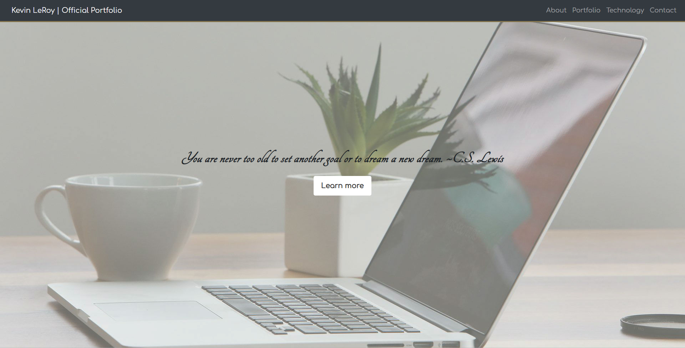

# DEPRECATION NOTICE -- NEW PORTFOLIO AT md-portfolio
I am a Full-Stack Web Developer specializing in the MERN Stack. I have over ten years of technical experience in both QA Automation and Program Management. As a lifelong problem solver and learner, I am always seeking new ways to overcome challenges, especially with the help of programming. This could be as simple as creating Reports which detail the number of assets being utilized in a given timeframe. To something slightly more complex like creating a Database driven website to track a shopping list based on a list of ingredients. I have a strong passion for process improvement and data-driven solutions. Working together to solve problems has been a hallmark of my career.



## Installation

Best viewed in Chrome Browser.

OS X:

```sh
brew cask install google-chrome
```

Linux/Ubuntu 64-Bit:

```sh
sudo apt install chromium-browser
```

Windows:

```sh
https://www.google.com/chrome/
```

## Technologies utilized

1. HTML5
1. CSS3
1. Bootstrap 4.3.1
1. jQuery

## Meta

Distributed under the MIT License. See [LICENSE](LICENSE) for more information.

[https://github.com/jobu206/github-link](https://github.com/jobu206/)


## Contributing

1. Fork it (<https://github.com/jobu206/Official-Portfolio/fork>)
2. Create your feature branch (`git checkout -b feature/Official-Portfolio`)
3. Commit your changes (`git commit -am 'Add some yourMessageHere'`)
4. Push to the branch (`git push origin feature/Official-Portfolio`)
5. Create a new Pull Request
